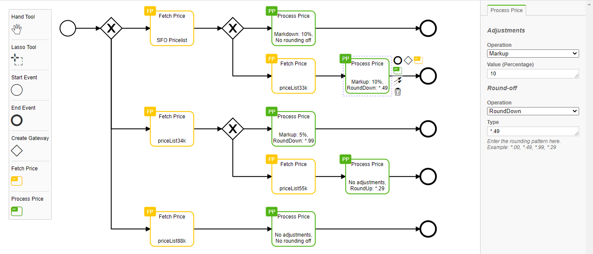

# Price-rules builder plugin #

View and edit price-rules diagrams in the browser.

### Summary ###

* This plugin can be used to create/edit a price-rule diagram.
* This is a JS plugin, built on top of BPMN-JS and will run on browsers.
* An example of a price rule construction using the plugin.



### Set up ###

* You need a [NodeJS](http://nodejs.org) development stack with [npm](https://npmjs.org) installed to build the project.

* To build the example into the `public` folder execute

```sh
npm run build
```

* To start the example execute

```sh
npm start
```
